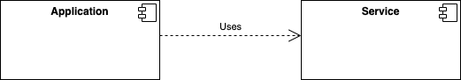

Transform the application as Cloud Native: ( Implement 12 factors as applicable)
--------------------------------------------------------------------------------
Factor 2 - Dependencies: Explicitly declare and isolate dependencies
    Additional code libraries used by the applications are declared in the POM.xml

Factor 3 - Configuration data: Store environment-specific configurations in environment variables
(Litmus test can we make this code repository opensource)
    DB URL /Credentials stored in Secrets and made available to container as environment variable

Factor 4 - Backing services: Treat backing services as remotely attached resources

Factor 5 - Build, release, run: Strictly separate build and run stages
    Maven compile the source code , and the container image is produced from the compiled artifact.  
    The immutable container image is deployed to each environment.

Other Factors like Portbinding etc. are implicitly taken care by Openshift.

Containerize Spring Boot Application using Liberty:
---------------------------------------------------
There are some benefits of running Spring Boot applications on the Open Liberty runtime:

1)Performance: Benchmarks have shows that Liberty perform better than Tomcat on both throughput and response time.

2)Size: The memory footprint of Liberty is smaller than tomcat, but more importantly the Spring Boot libraries can be separated from the runtime libraries.

When we look at the way Docker builds it's images using layers, the application portion is much smaller if we build out images in the optimized way.

This means faster build time, and if you're storing every version of your application you build, the delta between versions is much smaller

3)Support: If you're running on OpenShift using IBM Cloud Paks, using the Liberty runtime is included in your licensing model,

so using Liberty comes at no additional cost, but if need any support for Liberty it's included.

If you stick with standard Spring Boot with tomcat, you'll have to either run on an unsupported platform, or pay for additional support for the tomcat runtime.

4)Consistent runtime model. Running Liberty has many best practices especially in the Kubernetes/OpenShift world.

There are built in metrics and monitoring tools which are specifically designed to be integrated into OpenShift.

Using Liberty allows you to leverage many if these automatic connections to better maintain your environment.

-------------
Example Application:

--------------------

The current application is a simple application which tells given number is even or odd

The Spring boot application has a REST service , which accepts user request

The application calls evenodd service for calculation, the even odd service is part of dependent library

1. Create Server.xml file in the application
   Add the features in Feature Manager <feature>springBoot-2.0</feature>
                            <feature>servlet-4.0</feature>

2. Create a Docker file use base image openliberty/open-liberty:kernel-slim-java8-ibmjava-ubi

    This is a slim base image , we need to add the additional features as required

    liberty features ,springBootUtility which helps in thinning the container image

    liberty application server runs on port 9080

3. The Docker file used in this example below

ARG IMAGE=openliberty/open-liberty:kernel-slim-java8-ibmjava-ubi

FROM ${IMAGE} as staging

USER root

COPY --chown=1001:0  server.xml /config/

RUN features.sh

COPY --chown=1001:0  /target/Application-0.0.1-SNAPSHOT.jar /staging/myFatApp.jar

RUN springBootUtility thin \
 --sourceAppPath=/staging/myFatApp.jar \
 --targetThinAppPath=/staging/myThinApp.jar \
 --targetLibCachePath=/staging/lib.index.cache

FROM ${IMAGE}

USER root

COPY --chown=1001:0 server.xml /config

RUN features.sh

COPY --from=staging /staging/lib.index.cache /lib.index.cache

COPY --from=staging /staging/myThinApp.jar /config/dropins/spring/myThinApp.jar

ARG VERBOSE=false

RUN configure.sh

RUN chown -R 1001.0 /config && chmod -R g+rw /config

RUN chown -R 1001.0 /opt/ol/wlp/usr/shared/resources/lib.index.cache && chmod -R g+rw /opt/ol/wlp/usr/shared/resources/lib.index.cache

USER 1001

References:
-----------

    Please refer the documentation below for liberty cotainerization
    https://github.com/openliberty/ci.docker#building-an-application-image
    https://hub.docker.com/_/open-liberty
    https://openliberty.io/blog/2018/07/02/creating-dual-layer-docker-images-for-spring-boot-apps.html